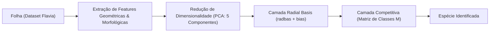

# Leaf Recognition with Probabilistic Neural Network (PNN)

Implementação de um sistema de classificação e reconhecimento de espécies de
folhas de plantas utilizando técnicas de **Visão Computacional** e **Redes
Neurais Probabilísticas (PNN - _Probabilistic Neural Network_)**, baseado na
metodologia do _Flavia Dataset_.

---

## Visão Geral do Projeto

A identificação precisa de espécies vegetais a partir de imagens de folhas é uma
tarefa clássica e fundamental em visão computacional e botânica computacional.

Este projeto explora o uso de características morfológicas/geométricas reduzidas
via **PCA (Principal Component Analysis)** combinadas a uma **Rede Neural
Probabilística (PNN)**. A PNN destaca-se por sua simplicidade arquitetural,
velocidade de treinamento (não necessita de algoritmos iterativos de
retropropagação como backpropagation) e robustez matemática baseada em funções
de base radial (RBF).

---

## Arquitetura e Metodologia

O pipeline do classificador é dividido nas seguintes etapas:



### 1. Extração de Características e PCA

- A partir das imagens de folhas segmentadas, são extraídas características
  geométricas e de formato.
- Aplica-se **PCA** para reduzir a dimensionalidade para os **5 componentes
  principais mais significativos ($R = 5$)**, mantendo as informações mais
  discriminativas e reduzindo o ruído.

### 2. Camada Radial Basis (Camada de Padrões)

- Calcula a distância euclidiana entre a amostra de entrada $p$ e os vetores de
  peso $W_{train}$ (amostras de treino): $$v = \|W_{train} - p^T\|_2$$
- Aplica-se o bias $b$, parametrizado pelo fator de suavização (_smoothing
  factor_) $s = \frac{1}{32}$: $$b = \frac{\sqrt{-\ln(0.5)}}{s}$$
  $$n = v \cdot b$$
- Função de ativação radial (_Radial Basis Function_): $$radbas(n) = e^{-n^2}$$

### 3. Camada Competitiva (Camada de Classes)

- As ativações são combinadas linearmente através da matriz de pesos one-hot $M$
  ($K \times Q_{train}$, onde $K = 32$ espécies): $$d = M \cdot a$$
- A camada competitiva determina a classe vencedora (_winner-takes-all_):
  $$\text{classe} = \operatorname{argmax}(d)$$

---

## Dataset (Flavia Leaf Dataset)

O projeto utiliza o conjunto de dados **Flavia**, composto por folhas em fundo
branco:

- **Total de imagens**: 1.907 amostras
- **Número de espécies**: 32 espécies botânicas
- **Protocolo de Validação**:
  - **Teste**: 10 amostras selecionadas por espécie (totalizando **320 amostras
    de teste**).
  - **Treino**: Amostras restantes (**1.587 amostras de treino**).

### Espécies Mapeadas

<details>
<summary><b>Clique para expandir a lista das 32 espécies</b></summary>

| ID  | Nome Científico           | Nome Popular / Comum      |
| :-- | :------------------------ | :------------------------ |
| 1   | _Phyllostachys edulis_    | Pubescent bamboo          |
| 2   | _Aesculus chinensis_      | Chinese horse chestnut    |
| 3   | _Berberis anhweiensis_    | Anhui Barberry            |
| 4   | _Cercis chinensis_        | Chinese redbud            |
| 5   | _Indigofera tinctoria_    | True indigo               |
| 6   | _Acer palmatum_           | Japanese maple            |
| 7   | _Phoebe nanmu_            | Nanmu                     |
| 8   | _Kalopanax septemlobus_   | Castor aralia             |
| 9   | _Cinnamomum japonicum_    | Chinese cinnamon          |
| 10  | _Koelreuteria paniculata_ | Goldenrain tree           |
| 11  | _Ilex macrocarpa_         | Big-fruited Holly         |
| 12  | _Pittosporum tobira_      | Japanese cheesewood       |
| 14  | _Chimonanthus praecox_    | Wintersweet               |
| 15  | _Cinnamomum camphora_     | Camphortree               |
| 16  | _Viburnum awabuki_        | Japan Arrowwood           |
| 17  | _Osmanthus fragrans_      | Sweet osmanthus           |
| 18  | _Cedrus deodara_          | Deodar                    |
| 19  | _Ginkgo biloba_           | Ginkgo                    |
| 20  | _Lagerstroemia indica_    | Crape myrtle              |
| 21  | _Nerium oleander_         | Oleander                  |
| 22  | _Podocarpus macrophyllus_ | Yew plum pine             |
| 23  | _Prunus serrulata_        | Japanese Flowering Cherry |
| 24  | _Ligustrum lucidum_       | Glossy Privet             |
| 25  | _Toona sinensis_          | Chinese Toon              |
| 26  | _Prunus persica_          | Peach                     |
| 27  | _Manglietia fordiana_     | Ford Woodlotus            |
| 28  | _Acer buergerianum_       | Trident maple             |
| 29  | _Mahonia bealei_          | Beale's barberry          |
| 30  | _Magnolia grandiflora_    | Southern magnolia         |
| 31  | _Populus ×canadensis_     | Canadian poplar           |
| 32  | _Liriodendron chinense_   | Chinese tulip tree        |
| 33  | _Citrus reticulata_       | Tangerine                 |

</details>

---

## Resultados e Discussão

- **Acurácia Geral Obtida**: **~75,62%** no conjunto de teste (320 amostras).
- **Tempo de Treinamento**: Instantâneo (atribuição direta de pesos e matrizes
  sem passos de gradiente).
- **Análise de Erros**:
  - As maiores taxas de erro concentram-se em espécies com alta similaridade
    visual e filogenética (ex.: _Cinnamomum japonicum_ e _Cinnamomum camphora_,
    ambas do gênero _Cinnamomum_).
  - A maioria das classes obteve taxa de acerto entre 80% e 100%.

---

## Estrutura do Repositório

```text
leaf-recognition-pnn/
├── data/                                # Diretório para armazenamento dos dados e features
│   └── leaf_features_pca.npy           # Matriz com as features extraídas e projetadas em PCA
├── notebooks/
│   └── leaf_recognition_pnn.ipynb      # Notebook com a implementação completa da PNN e análise
├── .gitignore                           # Regras de exclusão do Git
├── requirements.txt                     # Dependências do projeto
└── README.md                            # Documentação do projeto
```

---

## Como Executar

### 1. Clonar o Repositório

```bash
git clone https://github.com/ViktorSouza/leaf-recognition-pnn.git
cd leaf-recognition-pnn
```

### 2. Criar e Ativar um Ambiente Virtual (Opcional, porém recomendado)

```bash
python3 -m venv .venv
source .venv/bin/activate  # No Linux/macOS
# .venv\Scripts\activate   # No Windows
```

### 3. Instalar as Dependências

```bash
pip install -r requirements.txt
```

### 4. Executar o Notebook

```bash
jupyter notebook notebooks/leaf_recognition_pnn.ipynb
```

---

## ️ Tecnologias Utilizadas

- **Python 3**
- **NumPy**: Operações vetoriais e matriciais de alta performance em C.
- **Matplotlib**: Visualização de dados e gráficos de desempenho/erros.
- **Jupyter Notebook**: Ambiente interativo de experimentação e análise.
